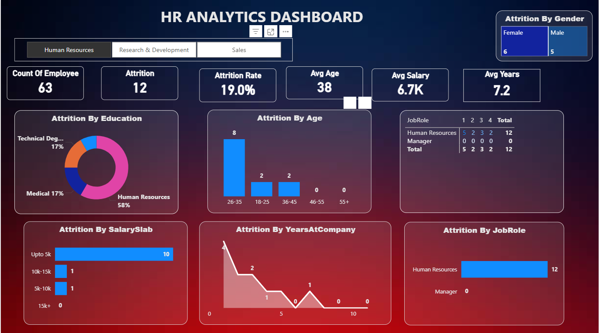
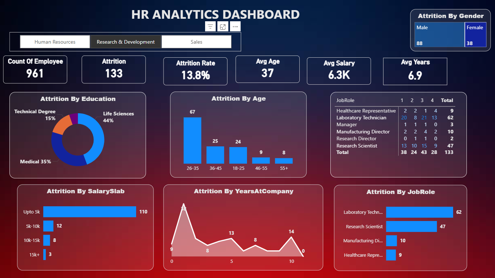
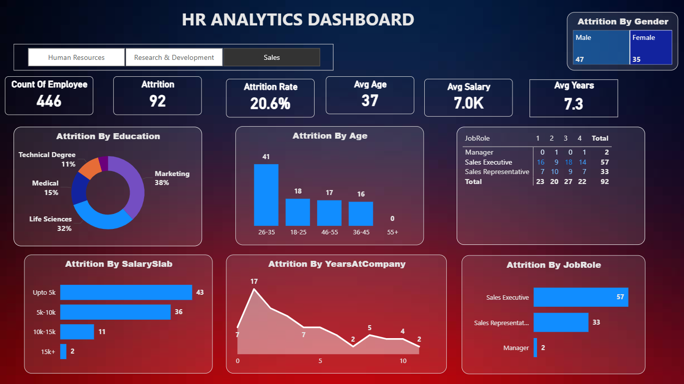

# HR Analytics Dashboard — Power BI

  

## Project overview
Interactive Power BI report analyzing employee attrition and workforce patterns. The report highlights where attrition is concentrated (by age, job role, salary band, tenure, department and other people dimensions) so HR and business leaders can prioritize retention actions.

---

## How this project was made
1. Data collection
   - Source: HR dataset exported to `HR_Analytics.csv` (also embedded in `HR_Analytics.pbix` in this repo). Contains employee-level fields such as EmpID, Age, Gender, Department, JobRole, SalarySlab, MonthlyIncome, YearsAtCompany, Attrition and several HR survey/metadata fields.
2. Data cleaning & validation
   - Normalized categorical values, fixed inconsistent labels (e.g., `TravelRarely` → `Travel_Rarely`).
   - Checked for duplicate EmpID values and missing fields; found 10 EmpID duplicates and 57 missing values in `YearsWithCurrManager`.
   - Converted numeric-like fields for analysis (MonthlyIncome, YearsAtCompany, TotalWorkingYears, etc.).
3. Exploration & analysis
   - Computed KPIs and distributions: attrition rate by AgeGroup, SalarySlab, JobRole, Department, Gender and Tenure.
   - Investigated top contributing factors using cross-tabs and filtered views.
4. Report development (Power BI)
   - KPIs: Count of Employees, Total Attrition, Attrition Rate, Average Age, Avg Salary, Avg Years at Company.
   - Visuals: bar charts (Attrition by Age, JobRole), pie/donut (Education), stacked tables (JobRole x AgeGroup), line/area (Attrition by YearsAtCompany), and slicers for Department / JobRole / SalarySlab / AgeGroup.
   - Design: three main pages (Human Resources, Research & Development, Sales) plus an executive KPI summary.

---

## Files included
- `HR_Analytics.pbix` — Power BI Desktop report (open in Power BI Desktop)
- `HR_Analytics.csv` — dataset used to build the report (employee-level CSV)
- `hr.png`, `rnd.png`, `sales.png` — screenshots of dashboard pages

---

## Preview

  

  

  

---

## Data summary (from `HR_Analytics.csv`)
- Records: 1480
- Columns: 38
- Attrition: No = 1242, Yes = 238 (overall attrition rate ≈ 16.1%)
- Department counts: Research & Development = 967, Sales = 450, Human Resources = 63
- Salary bands: Upto 5k = 753, 5k-10k = 444, 10k-15k = 150, 15k+ = 133
- Job roles (top): Sales Executive, Research Scientist, Laboratory Technician
- Data quality notes:
  - Duplicate EmpID entries: 10 (example duplicates present; verify source of duplicates)
  - Missing `YearsWithCurrManager`: 57 records
  - Inconsistent `BusinessTravel` labels (small number of `TravelRarely` values)

---

## Brief data dictionary (key fields)
- `EmpID` (string) — employee identifier
- `Attrition` (Yes/No) — attrition flag used as target
- `Age`, `AgeGroup` — numeric and bucketed age
- `Department`, `JobRole`, `Gender`, `MaritalStatus`, `EducationField` — categorical attributes
- `MonthlyIncome`, `SalarySlab` — numeric pay and categorical band
- `YearsAtCompany`, `TotalWorkingYears`, `YearsInCurrentRole`, `YearsWithCurrManager` — tenure and experience fields

---

## Key insights & recommended actions
- High attrition occurs in early-career salary bands and specific job roles: consider targeted retention programs (mentoring, upskilling, or pay-review) for these groups.
- Investigate line managers and teams that show above-average attrition for root-cause analysis (management training, workload, role fit).
- Enrich with qualitative data (exit interviews, engagement surveys) and performance metrics to prioritize interventions.

---

## How to open and use the report
1. Install Power BI Desktop (https://powerbi.microsoft.com/).  
2. Open `HR_Analytics.pbix` (file size: 0.16 MB).  
3. Preview screenshots are included: `hr.png`, `rnd.png`, `sales.png`.  
4. Use top-level slicers (Department, JobRole, AgeGroup, SalarySlab) and hover to inspect tooltips and value details.  
5. To share: File → Publish → Power BI Service and share via a workspace or an app.  
